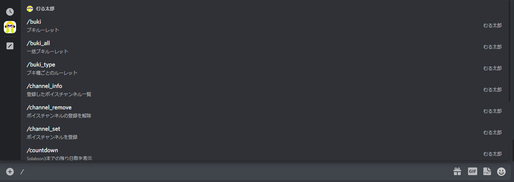

# スラッシュコマンド

## スラッシュコマンドとは

スラッシュコマンドとは、Discordのbotへコマンドを入力するためのものです。

Discordの仕様変更により、むる太郎では2022年9月より、これまでの「ぶき」のようなコマンドではなくスラッシュコマンドを利用することにしました。

スラッシュ(`/`)を入力することで、コマンドの一覧が表示されるので、コマンドを覚えなくても様々なbotのコマンドを入力することができるようになります。

仕様変更により、ご迷惑をおかけしますがよろしくお願いします。

## スラッシュコマンドが使えない

### コマンドの候補が表示されない場合

#### 他のbotのコマンド候補は表示されるが、むる太郎の候補だけ表示されない

Botにスラッシュコマンドに関する権限が付与されていない可能性があります。
こちらからむる太郎を再度導入してください。
<a href="https://discord.com/api/oauth2/authorize?client_id=603582186175725568&permissions=2147483648&scope=bot%20applications.commands" target="_blank">https://discord.com/api/oauth2/authorize?client_id=603582186175725568&permissions=2147483648&scope=bot%20applications.commands</a>

#### 他のbotのコマンド候補も表示されない
ユーザーにスラッシュコマンドの権限が付与されていない場合があります。
以下の手順に従って、スラッシュコマンドを有効化できます。

1. サーバーの設定を開く
2. 「ロール」を選択し、スラッシュコマンドを有効にしたいロールをクリックする
3. 権限の中にある「アプリコマンドを使う」をONにする

#### 上記2つを試しても表示されない
チャンネルの設定でスラッシュコマンドが無効化されている場合があります。
以下の手順に従って、スラッシュコマンドを有効化できます。

1. 該当のチャンネルの設定を開く
2. 「権限」に移動する
3. スラッシュコマンドを有効にしたいロールの「アプリコマンドを使う」をONにする。

### それでも解決しない場合
こちらからむる太郎を再度導入してください。
<a href="https://discord.com/api/oauth2/authorize?client_id=603582186175725568&permissions=2147483648&scope=bot%20applications.commands" target="_blank">https://discord.com/api/oauth2/authorize?client_id=603582186175725568&permissions=2147483648&scope=bot%20applications.commands</a>

または、[こちら](./about)にある連絡先にお願いします。
